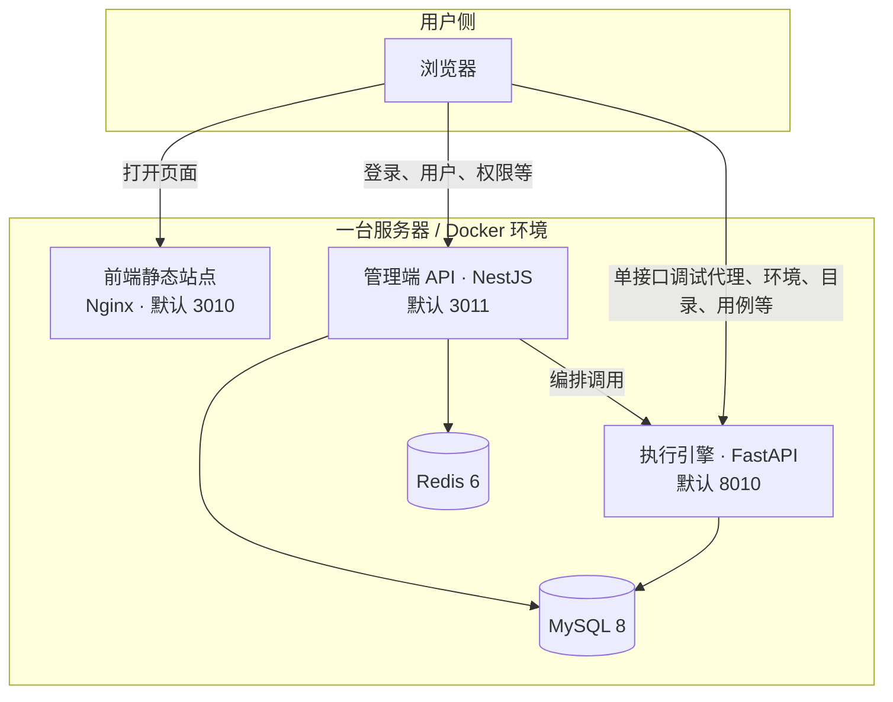
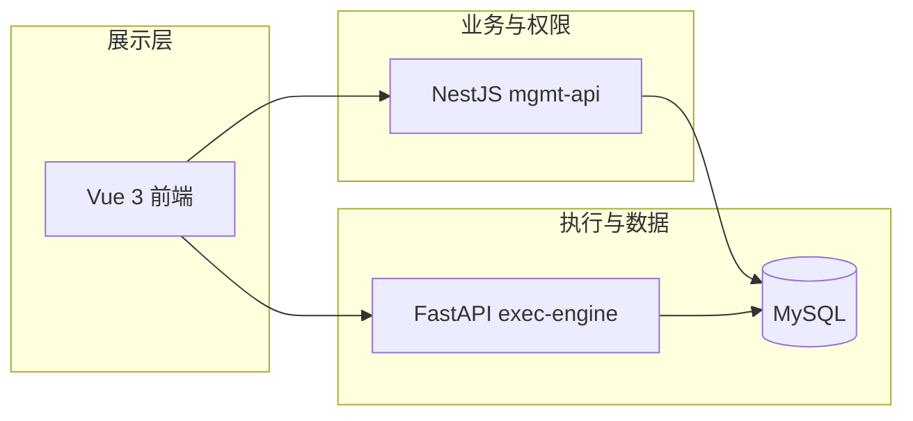

# AI 自动化测试平台

面向 **接口调试、接口管理、环境配置、测试场景与自动化执行** 的一体化工作台。你可以把它理解成：浏览器里的「接口文档 + Postman 式调试 + 环境变量 + 场景编排」，数据落在 MySQL，登录与权限由管理端 API 负责，真正发请求、跑场景由执行引擎完成。

---

## 一图看懂架构

### 部署拓扑（谁在访问谁）



### 逻辑分层（职责划分）



| 模块 | 技术 | 一句话 |
|------|------|--------|
| **frontend** | Vue 3 + Vite + Naive UI | 工作台界面：单接口测试、环境管理、自动化场景等 |
| **mgmt-api** | NestJS + TypeORM | 登录、JWT、用户/角色/权限、与管理相关的接口 |
| **exec-engine** | FastAPI + SQLAlchemy | 调试代理、环境/目录/接口/用例、执行与部分 AI 能力 |
| **MySQL** | 8.0 | 业务与 RBAC 数据持久化 |
| **Redis** | 6.x | 缓存与运行期能力（管理端使用） |

---

## 项目目录（精简版）

```text
AI_Project/
├── docker-compose.yml      # 一键拉起全部服务
├── docker/mysql/           # 库初始化 SQL、MySQL 配置
├── frontend/               # 前端（Vue + Vite）
├── mgmt-api/               # 管理端 API（NestJS）
├── exec-engine/            # 执行引擎（FastAPI）
└── README.md
```

更细的目录说明可参考各子项目内的 `package.json` / `requirements.txt`。

---

## 默认端口（Docker Compose）

| 服务 | 宿主机端口 | 说明 |
|------|------------|------|
| 前端 | **3010** | 浏览器访问入口 |
| 管理 API | **3011** | 登录、用户、权限等 |
| 执行引擎 | **8010** | 调试、环境、接口数据等；Swagger：`/docs` |
| MySQL | **3308** | 仅建议内网或本机使用 |
| Redis | **6380** | 同上 |

容器名：`ai_platform_fe_v1`、`ai_platform_mgmt_v1`、`ai_platform_exec_v1`、`ai_platform_mysql_v1`、`ai_platform_redis_v1`。

---

## 本地快速体验（有 Docker 时）

在项目根目录执行：

```bash
docker compose up -d
```

浏览器打开：**http://localhost:3010**

常用命令：

```bash
docker compose ps          # 查看状态
docker compose logs -f       # 看日志
docker compose down          # 停止
docker compose down -v       # 停止并清空数据库卷（慎用）
```

首次启动 MySQL 会执行 `docker/mysql/init_rbac_full.sql` 做初始化（见 `docker-compose.yml` 挂载）。

**默认数据库（Docker 映射到本机 3308）**

- 库名：`ai_automation_db`
- 用户：`root`
- 密码：`root_password`（**上云务必修改**）

---

## 云服务器部署（小白向）

下面假设你有一台 **Linux 云服务器**（推荐 **Ubuntu 22.04 LTS**），且会用 SSH 登录。全程在服务器上操作即可。

### 0. 你需要准备什么

- 服务器：**至少 2GB 内存**（MySQL + 三个服务同时跑更稳）
- 安全组/防火墙：先放行 **22**（SSH），部署阶段可临时放行 **3010、3011、8010**，或用 **80/443** 做反向代理（见下文「进阶」）
- 本机已安装 **Git**（或把项目 zip 上传到服务器）

### 1. 安装 Docker（Ubuntu 示例）

```bash
sudo apt update
sudo apt install -y ca-certificates curl gnupg
sudo install -m 0755 -d /etc/apt/keyrings
curl -fsSL https://download.docker.com/linux/ubuntu/gpg | sudo gpg --dearmor -o /etc/apt/keyrings/docker.gpg
echo "deb [arch=$(dpkg --print-architecture) signed-by=/etc/apt/keyrings/docker.gpg] https://download.docker.com/linux/ubuntu $(. /etc/os-release && echo "$VERSION_CODENAME") stable" | sudo tee /etc/apt/sources.list.d/docker.list > /dev/null
sudo apt update
sudo apt install -y docker-ce docker-ce-cli containerd.io docker-buildx-plugin docker-compose-plugin
```

验证：

```bash
sudo docker run hello-world
docker compose version
```

（若 `docker compose` 提示无权限，可把用户加入 `docker` 组：`sudo usermod -aG docker $USER` 后重新登录。）

### 2. 把代码放到服务器

```bash
cd ~
git clone <你的仓库地址> AI_Project
cd AI_Project
```

没有 Git 时：本机打包上传后解压到 `~/AI_Project` 即可。

### 3. 修改默认密码与密钥（必做）

编辑根目录 **`docker-compose.yml`**：

1. 修改 `MYSQL_ROOT_PASSWORD`，并同步修改 `mgmt_api_final`、`exec_engine_final` 里的 `DB_PASS`。
2. 修改 `JWT_SECRET` 为随机长字符串。
3. **不要**把真实的 LLM API Key 写进仓库：用环境变量或单独的 `.env`（可自行改造 compose 引用 `${DEEPSEEK_API_KEY}`），并确保 `.env` 加入 `.gitignore`。

数据库密码改过后，需与 `DB_PASS` 一致，否则 API 连不上库。

### 4. 启动

```bash
cd ~/AI_Project
docker compose up -d --build
```

第一次会构建镜像，可能需数分钟。

### 5. 用公网访问

假设服务器公网 IP 为 `1.2.3.4`：

- 前端：**http://1.2.3.4:3010**
- 管理 API：**http://1.2.3.4:3011**
- 执行引擎：**http://1.2.3.4:8010/docs**（接口文档）

**云厂商安全组**要放行对应 TCP 端口。

### 6. 前端连不上 API？（重要）

生产环境若用 **域名 + HTTPS + 路径反代**（例如 `https://hahaliu.cn`、`/api`、`/engine`），请按 **`docker/nginx/README-hahaliu.cn.md`** 操作：内含 Nginx 示例、证书路径、`VITE_MGMT_API_URL` / `VITE_EXEC_ENGINE_URL` 与执行引擎 `ROOT_PATH` 说明。

若暂时仍用 **IP + 端口** 访问，构建前端时把管理端、执行引擎写成公网可访问地址，例如：

```bash
# 构建参数示例（按你的 IP 修改）
docker compose build frontend_final --build-arg VITE_MGMT_API_URL=http://1.2.3.4:3011 --build-arg VITE_EXEC_ENGINE_URL=http://1.2.3.4:8010
docker compose up -d frontend_final
```

开发模式下仍默认 `localhost:3011` / Vite 代理 `/engine`。

### 7. 进阶：HTTPS

使用 **Let’s Encrypt**（如 `certbot`）或**云厂商证书**，在反代 Nginx 上配置 `listen 443 ssl`，并把 `http` 跳转到 `https`。  
**域名 + 云证书 + 单台 Docker** 的完整示例见：**[docker/nginx/README-hahaliu.cn.md](docker/nginx/README-hahaliu.cn.md)**（配置文件：**[docker/nginx/hahaliu.cn.conf](docker/nginx/hahaliu.cn.conf)**）。

---

## 本地开发（不用 Docker 跑全栈时）

| 模块 | 命令 | 默认地址 |
|------|------|----------|
| 前端 | `cd frontend && npm i && npm run dev` | 见 `vite.config.ts`（示例中端口 80 或按终端提示） |
| 管理 API | `cd mgmt-api && npm i && npm run start:dev` | 常见 `http://localhost:3000` |
| 执行引擎 | `cd exec-engine && pip install -r requirements.txt && python main.py` | `http://localhost:8000`，文档 `/docs` |

需先保证 **MySQL、Redis** 已启动，且环境变量与 `docker-compose.yml` 中逻辑一致（库名、密码、主机等）。

---

## 常见问题

| 现象 | 排查 |
|------|------|
| 页面能开但登录失败 | 浏览器 F12 → Network，看请求是否仍指向 `localhost:3011`；应改为服务器 IP/域名或走反代 |
| 调试发不出请求 | 执行引擎是否起来；`exec-request` 的 baseURL / 代理是否指向正确 |
| 想清空数据库重来 | `docker compose down -v` 后重新 `up`（**数据会丢**） |
| 构建失败 | 单独进入 `frontend` / `mgmt-api` 目录执行 `npm run build` 看具体报错 |

---

## 许可证

仓库若用于开源发布，请补充明确的 `LICENSE` 文件并在此引用。
